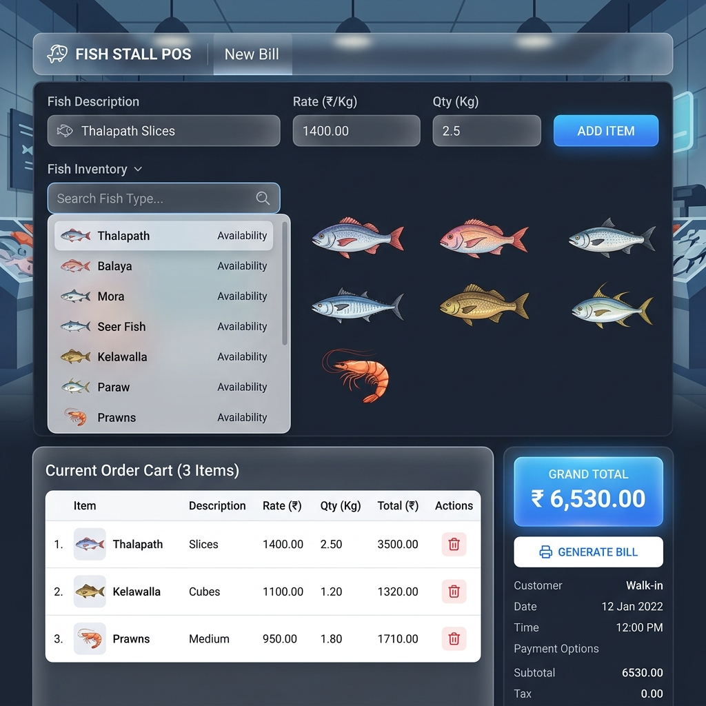
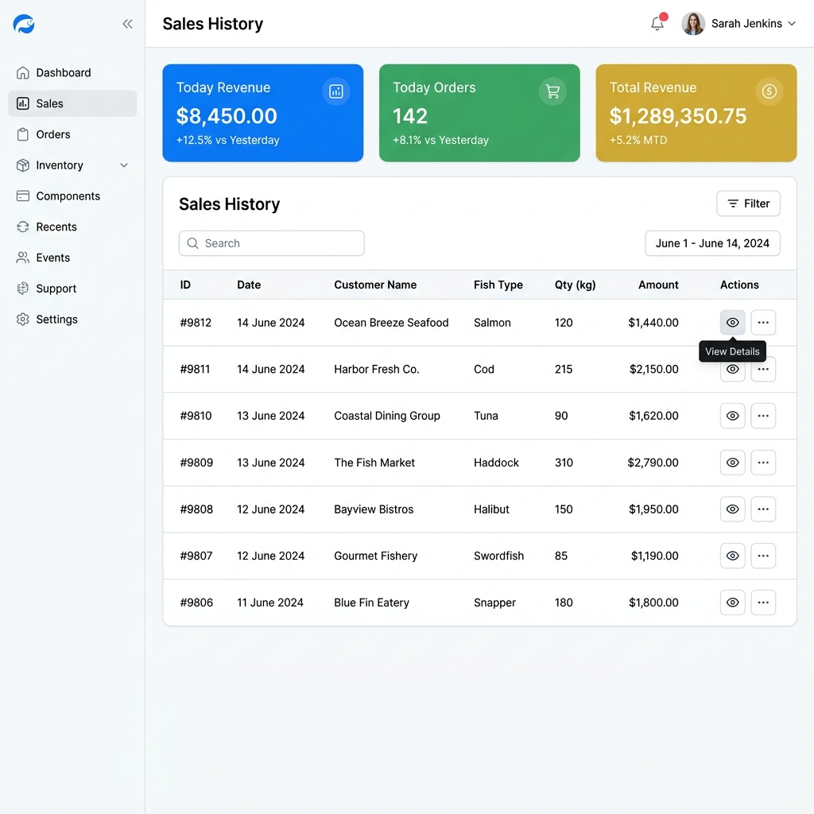
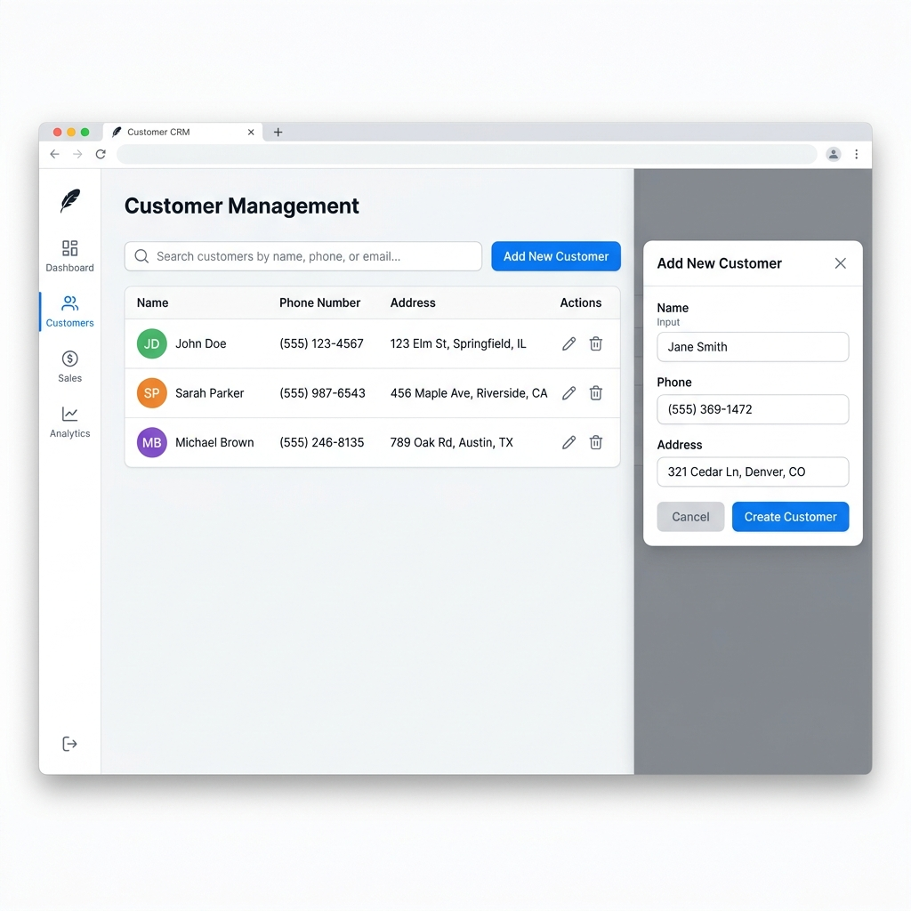
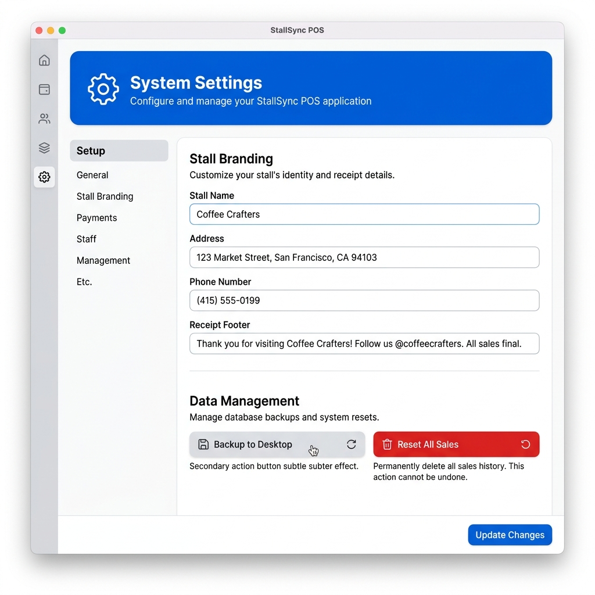

# 🐟 Fresh Fish Stall POS - High-Fidelity System

Professional, offline Desktop Point of Sale (POS) system designed for fish retail businesses.

## 🖼️ Application Screenshots

  
  

  
  

## ✨ Key Features

- 🛒 **Dynamic Billing**: Searchable fish species list with automatic rate calculation.
- 📊 **Sales History**: Track daily revenue, transaction counts, and detailed bill breakdowns.
- 👥 **Customer Management**: Database of loyal customers with contact details.
- 📑 **Professional Invoicing**: Generate clean PDF invoices with custom branding.
- ⚙️ **Advanced Settings**: Customize stall info, currency, and database backups.
- 💾 **Local Persistence**: SQLite3 for fast, offline data storage.

## 🛠️ Technology Stack
- **Frontend**: React.js
- **Desktop Framework**: Electron.js
- **Database**: SQLite3
- **Styling**: Vanilla CSS (Premium Glassmorphism UI)

## 🚀 How to Run
1. `npm install`
2. `npm run dev`

---
*Built with ❤️ by Indu Makaweeshvara*
