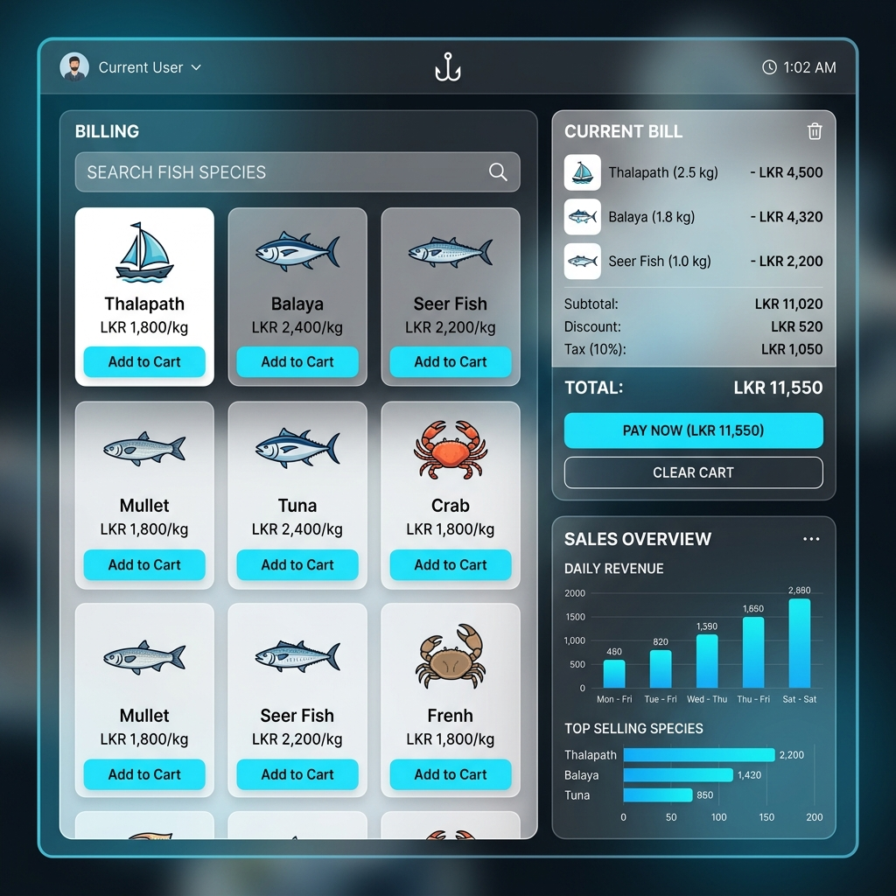

# 🐟 Fresh Fish Stall POS - High-Fidelity System



A professional, high-fidelity **Point of Sale (POS)** system designed specifically for fish stalls. This application provides a seamless, offline experience for managing sales, customers, and inventory with a premium user interface.

## ✨ Key Features

- 🛒 **Dynamic Billing**: Searchable fish species list with automatic rate calculation (optional manual entry).
- 📊 **Sales History**: Track daily revenue, transaction counts, and detailed bill breakdowns.
- 👥 **Customer Management**: Maintain a database of loyal customers with contact details and purchase history.
- 📑 **Professional Invoicing**: Generate clean, professional PDF invoices with custom branding (Stall name, Address, Phone, and Footer).
- ⚙️ **Advanced Settings**: Customize your stall info, select currency, and manage database backups directly to your desktop.
- 💾 **Local Persistence**: Powered by SQLite3 for lightning-fast, offline data storage.

## 🎨 Premium UI/UX
- **Modern Aesthetics**: Built with a "Glassmorphism" inspired design system.
- **Dynamic Feedback**: Smooth transitions, hover effects, and interactive components.
- **Ergonomic Layout**: Optimized for fast data entry in a busy retail environment.

## 🛠️ Technology Stack
- **Frontend**: [React.js](https://reactjs.org/)
- **Desktop Framework**: [Electron.js](https://www.electronjs.org/)
- **Database**: [SQLite3](https://www.sqlite.org/)
- **Icons**: [Lucide React](https://lucide.dev/)
- **Styling**: Vanilla CSS (Custom Design System)

## 🚀 Getting Started

### Prerequisites
- [Node.js](https://nodejs.org/) (Latest LTS recommended)
- npm

### Installation
1. Clone the repository:
   ```bash
   git clone https://github.com/indumakaweeshvara/FishStallSystem.git
   ```
2. Install dependencies:
   ```bash
   npm install
   ```
3. Run the application:
   ```bash
   npm run dev
   ```

## 📂 Project Structure
- `/src/pages`: Contains main application views (Billing, Sales, Customers, Settings).
- `/electron`: Main process logic and database configuration.
- `/src/utils`: Utility functions like the professional PDF generator.

## 📝 License
This project is for demonstration and commercial use for local fish stalls.

---
*Built with ❤️ by Indu Makaweeshvara*
